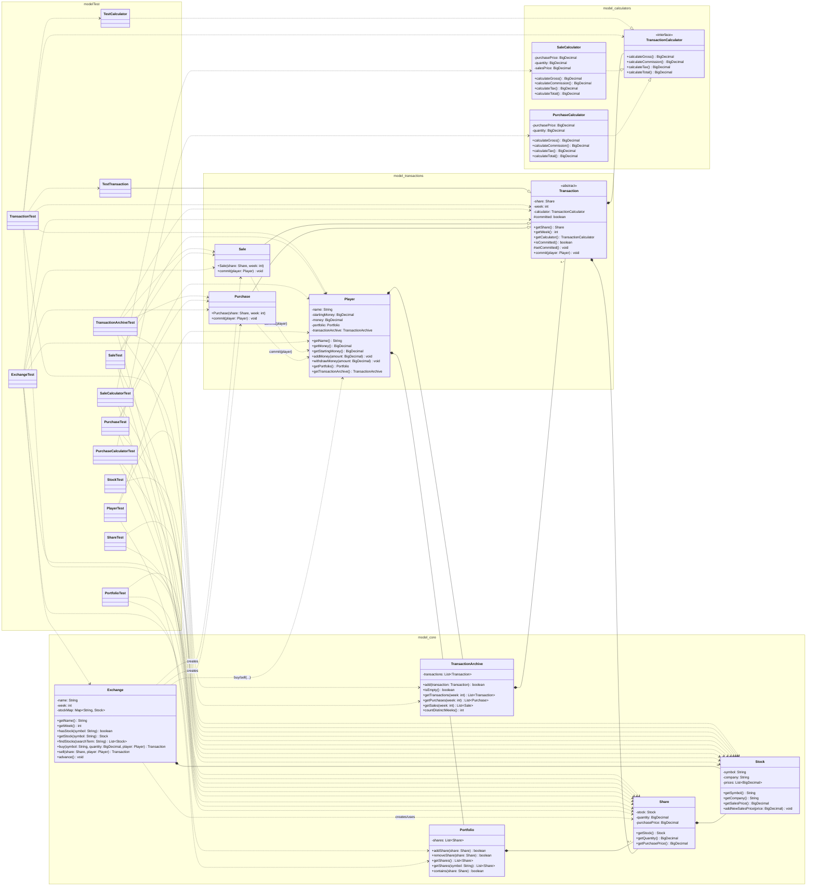

# UML-kart for Millions

Dette kartet dekker all Java-kode i prosjektet (`src/main/java` + `src/test/java`).

```mermaid
classDiagram
    direction LR

    namespace model_calculators {
        class TransactionCalculator {
            <<interface>>
            +calculateGross() BigDecimal
            +calculateCommission() BigDecimal
            +calculateTax() BigDecimal
            +calculateTotal() BigDecimal
        }

        class PurchaseCalculator {
            -purchasePrice: BigDecimal
            -quantity: BigDecimal
            +calculateGross() BigDecimal
            +calculateCommission() BigDecimal
            +calculateTax() BigDecimal
            +calculateTotal() BigDecimal
        }

        class SaleCalculator {
            -purchasePrice: BigDecimal
            -quantity: BigDecimal
            -salesPrice: BigDecimal
            +calculateGross() BigDecimal
            +calculateCommission() BigDecimal
            +calculateTax() BigDecimal
            +calculateTotal() BigDecimal
        }
    }

    namespace model_core {
        class Exchange {
            -name: String
            -week: int
            -stockMap: Map~String, Stock~
            +getName() String
            +getWeek() int
            +hasStock(symbol: String) boolean
            +getStock(symbol: String) Stock
            +findStocks(searchTerm: String) List~Stock~
            +buy(symbol: String, quantity: BigDecimal, player: Player) Transaction
            +sell(share: Share, player: Player) Transaction
            +advance() void
        }

        class Stock {
            -symbol: String
            -company: String
            -prices: List~BigDecimal~
            +getSymbol() String
            +getCompany() String
            +getSalesPrice() BigDecimal
            +addNewSalesPrice(price: BigDecimal) void
        }

        class Share {
            -stock: Stock
            -quantity: BigDecimal
            -purchasePrice: BigDecimal
            +getStock() Stock
            +getQuantity() BigDecimal
            +getPurchasePrice() BigDecimal
        }

        class Portfolio {
            -shares: List~Share~
            +addShare(share: Share) boolean
            +removeShare(share: Share) boolean
            +getShares() List~Share~
            +getShares(symbol: String) List~Share~
            +contains(share: Share) boolean
        }

        class TransactionArchive {
            -transactions: List~Transaction~
            +add(transaction: Transaction) boolean
            +isEmpty() boolean
            +getTransactions(week: int) List~Transaction~
            +getPurchases(week: int) List~Purchase~
            +getSales(week: int) List~Sale~
            +countDistinctWeeks() int
        }
    }

    namespace model_transactions {
        class Player {
            -name: String
            -startingMoney: BigDecimal
            -money: BigDecimal
            -portfolio: Portfolio
            -transactionArchive: TransactionArchive
            +getName() String
            +getMoney() BigDecimal
            +getStartingMoney() BigDecimal
            +addMoney(amount: BigDecimal) void
            +withdrawMoney(amount: BigDecimal) void
            +getPortfolio() Portfolio
            +getTransactionArchive() TransactionArchive
        }

        class Transaction {
            <<abstract>>
            -share: Share
            -week: int
            -calculator: TransactionCalculator
            #committed: boolean
            +getShare() Share
            +getWeek() int
            +getCalculator() TransactionCalculator
            +isCommitted() boolean
            #setCommitted() void
            +commit(player: Player) void
        }

        class Purchase {
            +Purchase(share: Share, week: int)
            +commit(player: Player) void
        }

        class Sale {
            +Sale(share: Share, week: int)
            +commit(player: Player) void
        }
    }

    namespace modelTest {
        class ExchangeTest
        class PlayerTest
        class PortfolioTest
        class PurchaseCalculatorTest
        class PurchaseTest
        class SaleCalculatorTest
        class SaleTest
        class ShareTest
        class StockTest
        class TransactionArchiveTest
        class TransactionTest
        class TestTransaction
        class TestCalculator
    }

    PurchaseCalculator ..|> TransactionCalculator
    SaleCalculator ..|> TransactionCalculator

    Purchase --|> Transaction
    Sale --|> Transaction

    Transaction *-- Share
    Transaction *-- TransactionCalculator
    Share *-- Stock
    Portfolio *-- "0..*" Share
    TransactionArchive *-- "0..*" Transaction
    Player *-- Portfolio
    Player *-- TransactionArchive
    Exchange *-- "0..*" Stock

    Exchange ..> Player : buy/sell(...)
    Exchange ..> Share : creates/uses
    Exchange ..> Purchase : creates
    Exchange ..> Sale : creates

    Purchase ..> Player : commit(player)
    Sale ..> Player : commit(player)

    ExchangeTest ..> Exchange
    ExchangeTest ..> Stock
    ExchangeTest ..> Share
    ExchangeTest ..> Player
    ExchangeTest ..> Purchase
    ExchangeTest ..> Sale
    ExchangeTest ..> Transaction

    PlayerTest ..> Player
    PlayerTest ..> Portfolio
    PlayerTest ..> TransactionArchive

    PortfolioTest ..> Portfolio
    PortfolioTest ..> Share
    PortfolioTest ..> Stock

    PurchaseCalculatorTest ..> PurchaseCalculator
    PurchaseCalculatorTest ..> Share
    PurchaseCalculatorTest ..> Stock

    SaleCalculatorTest ..> SaleCalculator
    SaleCalculatorTest ..> Share
    SaleCalculatorTest ..> Stock

    PurchaseTest ..> Purchase
    PurchaseTest ..> Player
    PurchaseTest ..> Share
    PurchaseTest ..> Stock

    SaleTest ..> Sale
    SaleTest ..> Player
    SaleTest ..> Share
    SaleTest ..> Stock

    ShareTest ..> Share
    ShareTest ..> Stock

    StockTest ..> Stock

    TransactionArchiveTest ..> TransactionArchive
    TransactionArchiveTest ..> Transaction
    TransactionArchiveTest ..> Purchase
    TransactionArchiveTest ..> Sale
    TransactionArchiveTest ..> Share
    TransactionArchiveTest ..> Stock

    TransactionTest ..> Transaction
    TransactionTest ..> Player
    TransactionTest ..> Share
    TransactionTest ..> Stock
    TransactionTest ..> TransactionCalculator
    TestTransaction --|> Transaction
    TestCalculator ..|> TransactionCalculator
    TransactionTest ..> TestTransaction
    TransactionTest ..> TestCalculator
```
